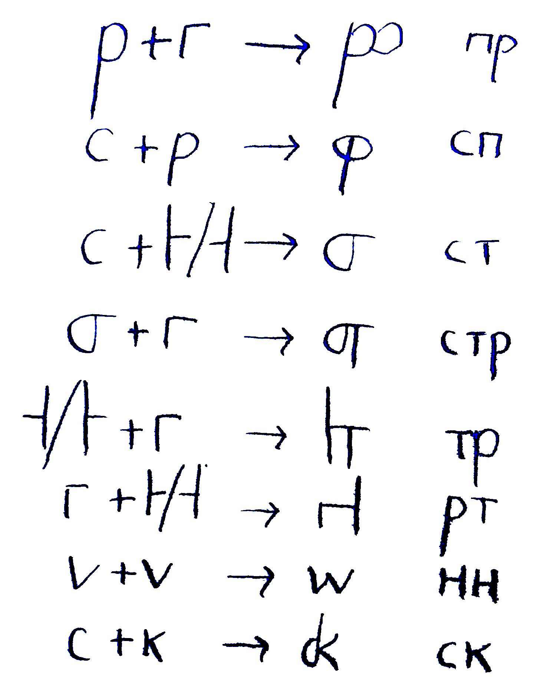
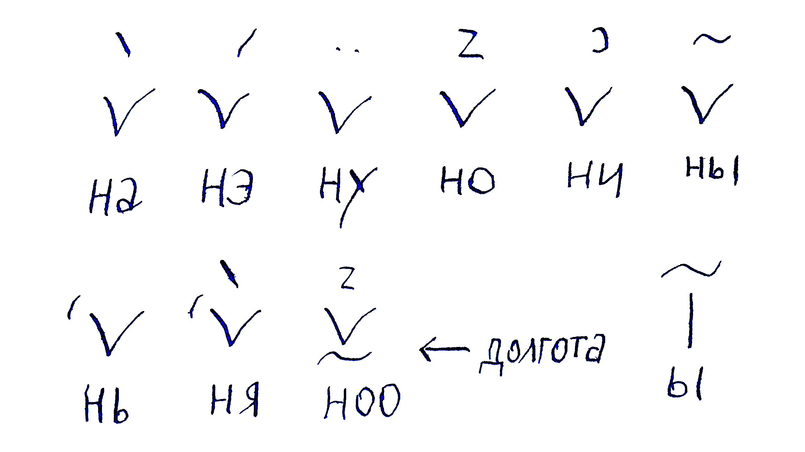
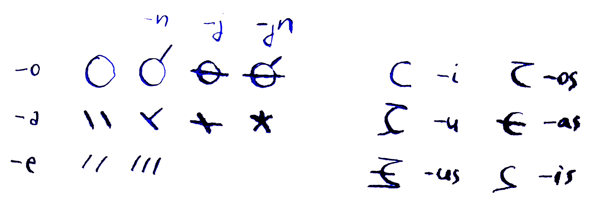
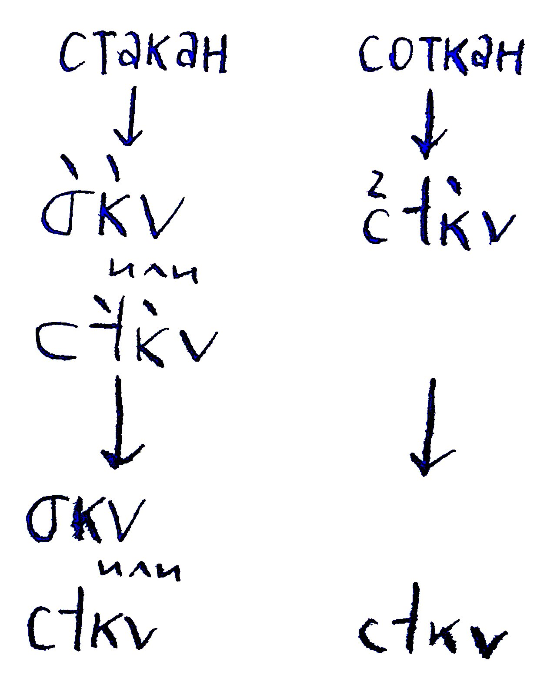
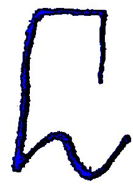
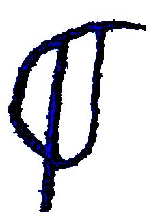
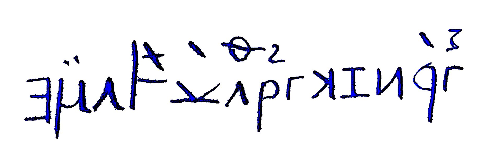
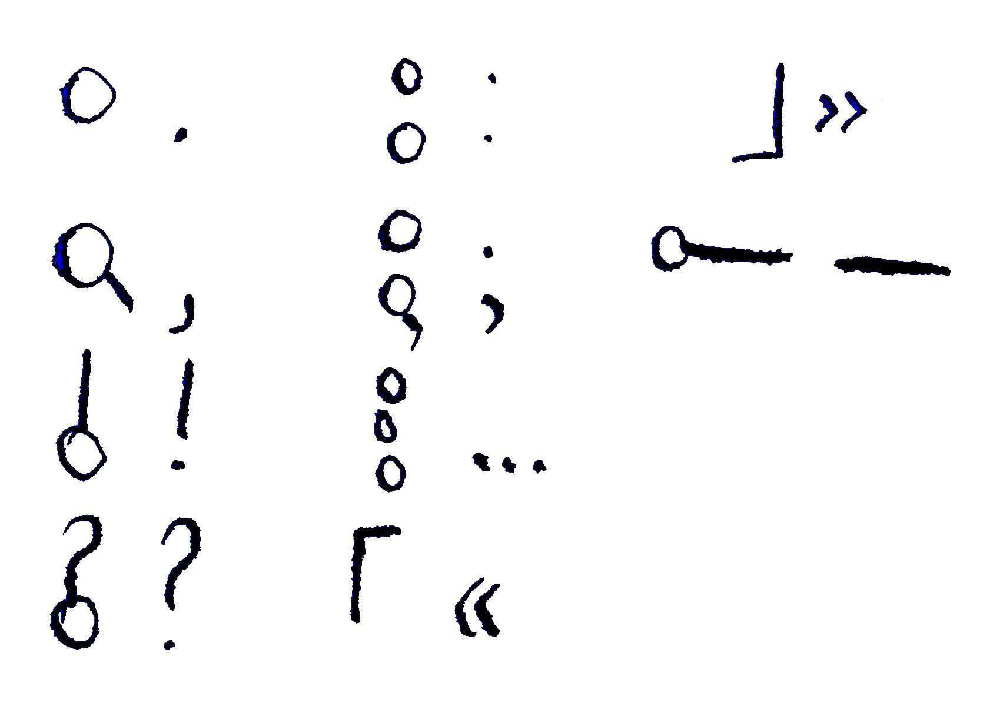
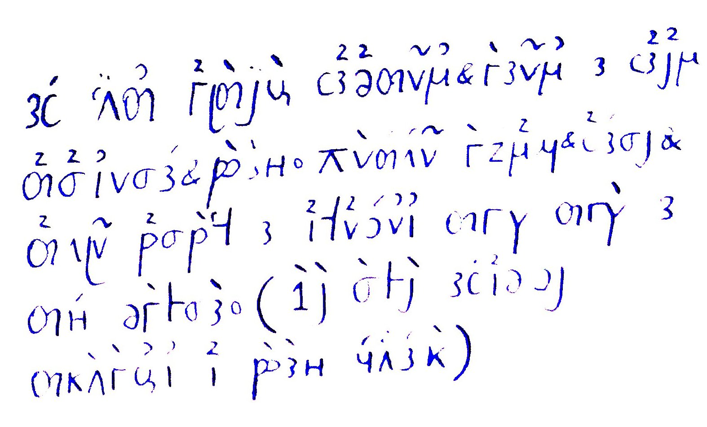
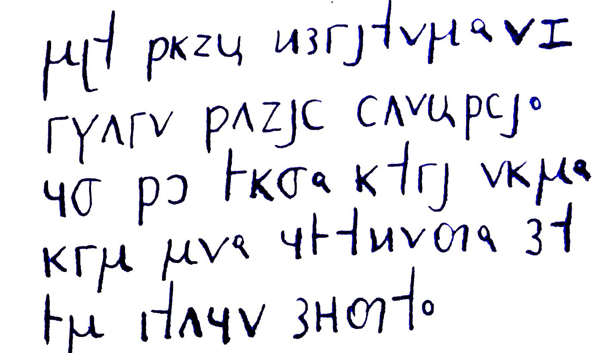

# Солнцепись

Одно из моих главных увлечений — конскрипты (*CONstructed SCRIPT* — самодельные письменности). Сколько себя помню, они рядом со мной. В этой статье рассказываю про один из своих конскриптов. Первая версия появилась в незапамятные времена. Он много раз переделывался, но суть осталась примерно та же.

Название тоже менялось очень много раз, потому что старые названия постоянно забывал. Название *солнцепись* мне не особо нравится, я уверен, что я и получше придумывал, но некоторые люди знают конскрипт именно под этим названием. Вообще-то, название очень банальное. Есть как минимум ещё один [конскрипт](https://www.omniglot.com/conscripts/sunscript.htm) с похожим названием. Ну ладно.

## История

Когда я был молод, решил из букв латинского, кириллического и греческого алфавита сделать свой. Сел, сделал. Он много менялся. Это была история другого конскрипта. В неопределённый момент времени от того отфоркался этот. А может он и сам получился. В общем, происхождение покрыто мраком. 

Алфавит явно проходил несколько этапов развития, что видно по старым записям (заниматься историей собственной письменности интересно). В какой-то момент алфавит был заморожен и стабилен. Летом 2019 я посетил Грузию и под впечатлением от местной письменности обновил свою.

Вот про эту версию я и буду говорить. Предыдущую я всё ещё могу читать с определённым трудом, но она меня уже не волнует.

## Состав письменности

Письменность состоит из консонантного алфавита, набора лигатур, горстки диакритик и набора иероглифов. Их состав не был постоянным и вечно менялся. В этой статье канонизирую всё, что надо.

### Алфавит

Консонантный, то есть в нём есть буквы только для согласных звуков. Гласные обозначаются диакритикой. Диакритика пишется над буквой и читается после той буквы, над которой она написана.

Так работает полностью консонантный алфавит, но у меня не такой, потому что он развивался несколько лет и использовался в реальных условиях, поэтому есть диакритики, которые обозначают не только гласные звуки, но и целые морфемы. Но про них потом.

Поскольку письменность в основном используется для записи текстов на эсперанто или русском языке, буквы алфавита солнцеписи будут сравниваться именно с их алфавитами. Также есть столбик с прочтением в МФА, но данные прочтения не абсолют: аналог русской буквы *Р* при записи текста на эсперанто или русском остаётся самой собой (звонкий альвеолярный дрожащий согласный [r]), но при записи текста на английском это уже другой звук (постальвеолярный аппроксимант [ɹ]).

Так уж вышло, что почти у каждой буквы есть более-менее похожий аналог в уникоде. К сожалению, 100%-ного совпадения не получилось, поэтому вот примерные значки в таблице:

| Буква | МФА  | Эсперанто аналог | Кириллический аналог | Происхождение                                                |
| ----- | ---- | ---------------- | -------------------- | ------------------------------------------------------------ |
| \|    | —    | —                | —                    | Про себя называю эту букву словом *алеф*. Не обозначает звука. Нужна, чтобы надписать над ней гласную |
| ə     | b    | b                | б                    | Упрощение грузинской ბ [b]                                   |
| Ա     | t͡s   | c                | ц                    | Упрощение кириллической ц                                    |
| ч     | t͡ʃ   | ĉ                | ч                    | Кириллическая ч                                              |
| თ     | d    | d                | д                    | Грузинская თ [tʰ]                                            |
| ᑫ     | f    | f                | ф                    | Упрощение кириллической ф или отражение латинской p          |
| γ     | g    | g                | г                    | Греческая γ [ɡ]                                              |
| Ꮽ     | d͡ʒ   | ĝ                | дж, џ                | Отброс циркумфлекса у эсперантской ĝ, оставшееся закруглено  |
| H     | h    | h                | х                    | Латинская H                                                  |
| ᒍ     | j    | j                | й                    | Отброс точки у латинской j. Заходит под предыдущую букву     |
| ᒐ     | ʒ    | ĵ                | ж                    | Отброс точки у латинской j и отражение. Заходит под следующую букву |
| к     | k    | k                | к                    | Кириллическая или греческая к                                |
| Λ     | l    | l                | л                    | Вариант кириллической л или греческая Λ [l]                  |
| μ     | m    | m                | м                    | Греческая μ [m]. Также допустим отражённый горизонтально вариант этой буквы. Я просто вечно забывал, в какую сторону пишется буква :) |
| v     | n    | n                | н                    | Греческая ν [n]                                              |
| ρ     | p    | p                | п                    | Упрощение латинской p                                        |
| ᒥ     | r    | r                | р                    | Упрощение латинской r                                        |
| с     | s    | s                | с                    | Кириллическая с                                              |
| ᑐ     | ʃ    | ŝ                | ш, щ                 | Отражение кириллической с                                    |
| ├, ┤  | t    | t                | т                    | Упрощение латинской t, второй вариант получился отражением. Варианты выбираются исходя из красоты в конкретном случае. |
| ω     | ʋ    | ŭ                | ў                    | Упрощение латинской w                                        |
| ვ     | v    | v                | в                    | Грузинская ვ [v]                                             |
| z     | z    | z                | з                    | Латинская z                                                  |

А вот весь алфавит, записанный моим пером:

Такие пропорции считаются каноничными. Как видно, у некоторых букв есть выносные элементы. У двух букв есть по два варианта. Две буквы заходят под соседние буквы. Большинство букв примерно одной ширины, но некоторые узкие, а некоторые широкие. Заголовок сверху читается так: *konsonantoj de sunskribo*, то есть *согласные солнцеписи*.

### Лигатуры

Некоторые сочетания букв превратились в отдельные буквы. Я их использую всегда. Они экономят пространство. Если не писать диакритику, то лигатуры упрощают чтение.

### Диакритика

Диакритика пишется либо над буквой, либо под ней. Те, что пишутся сверху, читаются после прочтения самой буквы (включая лигатуры). Те, что снизу, модифицируют букву либо верхнюю диакритику.

Есть шесть диакритик для шести гласных звуков русского языка. Звуки эсперанто совпадают. В английском гласных гораздо больше, но они выражаются теми диакритиками, которыми я бы воспользовался, если бы писал транслитом кириллицей (*bad*, *bed* → *бед*, вот это уже в солнцепись). Апостроф слева от буквы обозначает паллатализацию. Тильда под буквой обозначает долготу гласного над буквой, но не повторение этого гласного, то есть [a:] и [a.a] пишутся по-разному. Также на картинке есть пример применения буквы алеф.

А ещё есть диакритики, соответствующие окончаниям в эсперанто. Ими необязательно пользоваться, но они делают текст компактнее. Кстати, после букв с такими диакритиками необязательно писать пробел. По идее, ими можно пользоваться и для записи русского языка, используя их для выражения аналогичных окончаний в русском, но русский недостаточно регулярен, и получается нечто нечитаемое, поэтому не советую.

Ещё есть такие:

- Запятая под буквой обозначает, что вместо данного звука надо использовать какой-нибудь похожий. Две запятые значат, что надо использовать второй похожий звук. Точного определения нет и не будет. Например, v без запятых значит [n], v с одной запятой значит [ŋ], v с двумя запятыми значит [ɲ]. 
- Точка под буквой заменяет пробел после буквы; используется в декоративных целях или для экономии пространства.

Кстати, можно диакритику не писать, если соблюдать некоторые правила:

1. Специальные эсперантские диакритики не использовать.
2. Не использовать подбуквенную точку.
3. Крайне желательно использовать все существующие лигатуры. Вот пример того, как использование лигатур упрощает обратную расшифровку:
   

### Иероглифы

Для частых морфем и слов есть отдельные значки-иероглифы. Их немного, но их знание делают запись гораздо компактнее. Как и буквы, они способны принимать на себя диакритику. До и после ерога (ерог = иероглиф) пробелы можно не писать.

Прочтение каждого ерогоа зависит от языка, на котором записан текст. Лучше всего подходит для эсперанто, понятное дело. В русском я очень мало ерогов применяю.

Опять-таки, для большинства нашлись значки в уникоде. Совпадение не точное, поэтому анонимному читателю остаётся представить, что они все размером с букву v.

| Иероглиф                                             | Чтение, эсперанто                    | Чтение, русский                           | Заметки                                                      |
| ---------------------------------------------------- | ------------------------------------ | ----------------------------------------- | ------------------------------------------------------------ |
|  | -skrib-, -graf- (в греческих словах) | -пиш-, -пис-, -граф- (в греческих словах) | Самый первый ерог. Остальные ероги тех лет давно отменены, но этот живуч. Изображает карандаш. |
| Δ                                                    | de, da                               |                                           | Старое написание буквы [d], решил применить для этого частого слова. |
| ߂                                                    | ĉu                                   | ли                                        | Отражение Ч [t͡ʃ].                                            |
| 𝈎                                                    | ki-                                  |                                           | Перевёрнутая К. Используется в [коррелятивных словах](https://ru.wikipedia.org/wiki/Лексика_эсперанто#Таблица_коррелятивных_слов ). Шире остальных ерогов. |
| T                                                    | ti-                                  |                                           | Буква Т. Используется в коррелятивных словах.                |
| h                                                    | ĉi-                                  |                                           | Перевёрнутая Ч. Используется в коррелятивных словах.         |
|    | -est-                                | это (в случаях типа «X — это Y»)          | Образован как лигатура слова est. Тоже один из самых древних. |
| ¤                                                    | -nov-                                | -нов-                                     | Выглядело круто.                                             |
| ◫                                                    | -ar-                                 | -арь-                                     | Множество, как в словах *словарь* или *vortaro*.             |
| L                                                    | la                                   | —                                         | Первая буква LA. Определённый артикль.                       |
| 工                                                   | mi                                   | я                                         | Выглядело круто.                                             |
| 王                                                   | ni                                   | мы                                        | *Я* с перечёркиванием.                                       |
| ▽                                                    | vi                                   | ты, вы                                    | Старое написание буквы [v], слитое со старым написанием [i]. Нейтрально окрашенное слово. Если хочется подчеркнуть *вытость* сказанного, то лучше не использовать ерог. |
| ᕈ                                                    | ri                                   | он(_, о, а)                               | Гендерно-нейтральное местоимение. Слитое написание [ri].     |
| ⚻                                                    | ili                                  | они                                       | Слитое написание [li] в старом написании.                    |
| G                                                    | ĝi                                   | он(_, о, а)                               | Только для неодушевлённых. Первая буква GXI.                 |
| &                                                    | kaj                                  | и                                         | Канонизация амперсанда как ерога.                            |
| ∃                                                    | Estas                                | Есть                                      | Аналог такого же знака в математике. Используется для обозначения существования чего-либо, как в предложениях *Estas multaj katoj* или *Есть много котов*. |
| И                                                    | ne, ne-                              | не, не-                                   | Можно и как отдельное слово, можно и как составляющую слова. Получился отражением первой буквы NE. |
| 𝈲                                                    | ke                                   | что (союз)                                | Отражение первой буквы KE.                                   |

Также к иероглифам приравниваются все западно-арабские цифры: 0123456789.

Вот пример фразы с иероглифами. Тут написано *Estas multaj kialoj por ke mi ne faru*, что значит *Есть много причин, чтобы я не делал*. Не делал *что* — я не придумал.

### Пунктуация

Есть набор альтернативной пунктуации. Можно использовать знаки по настроению. Все знаки начинаются с точки в центре строки, кроме кавычек. Остальные знаки совпадают с привычными.

## Применение

Может показаться невероятным, но я регулярно пользуюсь солнцеписью. Часто пишу тексты, которые никому, кроме меня, читать не надо, вот там отлично входит. А ещё тексты на солнцеписи на эсперанто такие компактные выходят, почти без пробелов, это радует.

## Тексты

Чтобы было понятнее, вот ещё набор текстов на солнцеписи. Если анонимный читатель решил изучить её, то тексты очень помогут.

### Всеобщая декларация о правах человека

Я так понимаю, этим текстом традиционно показывают свои конскрипты. На [омниглоте](https://www.omniglot.com/conscripts/conlangs.htm) так. Продолжаю традицию. Тонкие линии пропали на фото, но их можно додумать!

*Все люди рождаются свободными и равными в своем достоинстве и правах. Они наделены разумом и совестью и должны поступать в отношении друг друга в духе братства. (1-я статья всеобщей декларации о правах человека)*

### Ho, mia kor

Это стихотворение — первый записанный текст на эсперанто. Вот первое четверостишие.

*Ho, mia kor', ne batu maltrankvile,*
*El mia brusto nun ne saltu for!*
*Jam teni min ne povas mi facile,*
*Ho, mia kor'!*

### Метатекст

Этот текст уже знаком. В этот раз без диакритики.

*Может показаться невероятным, но я регулярно пользуюсь солнцеписью. Часто пишу тексты, которые никому, кроме меня, читать не надо, вот там отлично входит.*

## Заключение

Наконец-то рассказал про этот конскрипт! Есть ещё парочка: лунопись, основанная на солнцеписи, и сатурнопись, основанная на [еврейской рукописи](https://ru.wikipedia.org/wiki/Еврейское_рукописное_письмо ).

Мораль думайте сами.

