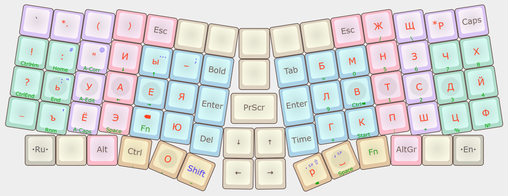

# Фонетические раскладки

Когда создаёшь эргоклаву, встаёт вопрос раскладки. Люди идут тремя путями:

1. Использовать стандартные ЙЦУКЕН или QWERTY,
2. Использовать какую-нибудь известную раскладку типа Дворака, Колемака или Воркмана для английского, Диктора или Зубачёва для русского,
3. Создать свою раскладку и ей пользоваться.

В этой статье я не буду рассказывать, как создавать раскладки, а расскажу про полезный приём при синхронном создании двух раскладок, например, русской и английской.

## JCUKEN и ЯВЕРТЫ

На самом деле идея фонетических раскладок не нова; раскладки JCUKEN и ЯВЕРТЫ существуют с прошлого века. Первая получилась как попытка подогнать английскую раскладку под русскую ЙЦУКЕН, а вторая — как попытка подогнать русскую под английскую QWERTY.

Вот так выглядит ЯВЕРТЫ:

А вот так выглядит JCUKEN на советском компьютере [Ассистент-128](https://computer-museum.ru/articles/personalnye-evm/968/):

Из этих двух довольно хороша JCUKEN, потому что она основана на ЙЦУКЕН, которая в целом терпима. ЯВЕРТЫ ни о чём, потому что QWERTY ни о чём. Можно в свою клавиатуру поставить комплект ЙЦУКЕН/JCUKEN, и будет довольно хорошо.

Например, так сделал Волька ещё в [2010 году](http://ibnteo.klava.org/keyboard/jcuken), немного изменив JCUKEN:

## Другие классические фонетические раскладки

Когда локализировали компьютеры для разных стран, часто брали QWERTY за основу и меняли буквы на алфавит своего языка. Например, греческий:

Грузинский:

Кхмерский:

Есть и другие.

## Преимущества фонетических раскладок

- **Лёгкость изучения двух раскладок.** Если одна фонетически похожа на другую, тем легче учится вторая. Логично.
- **Транслит в подарок.** Если забыть поменять раскладку, то текст останется более-менее читабельным. *Naprimer, 'to predlo"enie napisano tak, budto w zabvl pomenwtf rascladcu.*
- **Эргономичность.** Если одна из двух раскладок эргономична, то и вторая будет тоже, потому что частотности букв в языках очень похожи. Про этот пункт будет подробнее ниже.

## Частотность

Я сделал картинку-сравнение частотностей русского и английских языков. Данные с Википедии. Цветными линиями соединил буквы, которые можно посчитать фонетичными друг другу:

Анонимный читатель, обрати внимание: 8 самых частотных букв совпадают! Порядок немного другой, но это не так важно. Далее по списку многие буквы тоже обладают похожей частотностью. Впрочем, некоторые пары ломают это: hх, fф, vв, kк, cц.

## Неполная фонетичность

Собственно, вот приём. Такие вот ломающие пары надо разьединять, и на одну клавишу ставить несвязанные буквы. Поскольку таких пар немного, то раскладки всё равно получатся фонетическими, но гораздо эргономичнее. Полная фонетичность всё равно не получится, потому что у русского и английского слишком разные фонологии.

К примерам хороших нефонетичных пар отношу hв, kз, wя. Но надо самому смотреть при создании своих раскладок.

## Раскладки, следующие этому принципу

В нашем клавиатурном сообществе есть люди, которые создали свои фонетические раскладки. Например, я. Вот раскладка для [Сагариса](https://kle.klava.org/#/gists/5722ae3ff22ae2ea6685f39b8f2a472f) (на картинке только фингеры):

Или вот [Оптима Каназея](http://klavogonki.ru/u/#/439088/):

Анонимный читатель, если твоя раскладка тоже следует этому принципу, то напиши, добавлю.

## Заключение

Фонетические раскладки хороши и полезны. Надеюсь, я смог в этом убедить.
